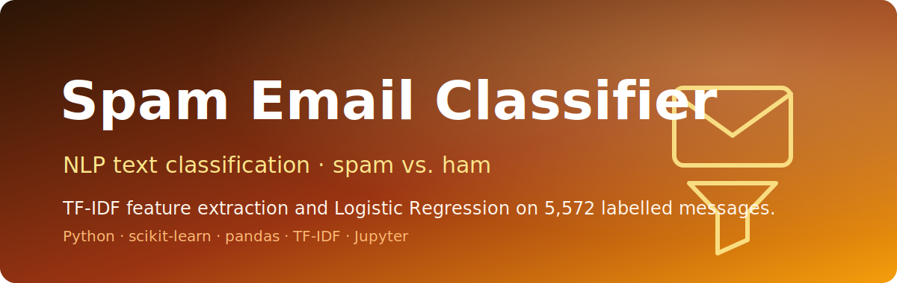

<p align="center">
  
</p>

<h1 align="center">Spam Email Classifier</h1>

<p align="center"><em>Classifying messages as spam or ham with TF-IDF features and Logistic Regression.</em></p>

<p align="center">
  
  
  
  
  
</p>

A **machine-learning notebook** that classifies short messages as **spam** or **ham (legitimate)**. It vectorizes raw message text with **TF-IDF** and trains a **Logistic Regression** classifier on **5,572 labelled messages** from `mail_data.csv`, using **scikit-learn** and **pandas**. The whole pipeline — load, label-encode, vectorize, train, evaluate, predict — lives in a single reproducible Jupyter notebook.

> Catching spam is a precision game: the cost of hiding a real message is high, so the features and the metric have to match the problem.

---

## ✨ Features
- **End-to-end notebook** covering data loading through single-message prediction.
- **TF-IDF feature extraction** with English stop-word removal and lowercasing (`min_df=1`).
- **Logistic Regression** classifier from scikit-learn.
- **Label encoding** of categories (`spam = 0`, `ham = 1`).
- **80/20 train/test split** (`random_state=3`) for reproducible evaluation.
- **Predictive system** that scores a new raw message and prints `Spam mail` / `Ham mail`.

## 🏗️ Pipeline
```text
mail_data.csv (5,572 messages)
        │
        ▼
  Load & clean            pandas read_csv → fill nulls with ''
        │
        ▼
  Label encoding          spam → 0,  ham → 1
        │
        ▼
  Train/test split        80% / 20%,  random_state=3
        │
        ▼
  Feature extraction      TfidfVectorizer(stop_words='english', lowercase=True, min_df=1)
        │
        ▼
  Train classifier        LogisticRegression().fit(X_train, Y_train)
        │
        ▼
  Evaluate & predict      accuracy_score  →  classify new messages
```

## 🚀 Run it
This project is a Jupyter notebook. Clone, install the dependencies, and run all cells.

```bash
# 1. Clone
git clone https://github.com/Usman1Abbas/Spam-Email-.git
cd Spam-Email-

# 2. Install dependencies
pip install numpy pandas scikit-learn notebook

# 3. Launch the notebook
jupyter notebook Project_17_Spam_Mail_Prediction_using_Machine_Learning.ipynb
```

> **Note:** the notebook loads the dataset with an absolute Windows path. Update the
> `pd.read_csv(...)` cell to point at the bundled file, e.g. `pd.read_csv('mail_data.csv')`,
> before running.

## 📊 Results
Logistic Regression on the TF-IDF features achieves:

| Split          | Accuracy |
| -------------- | -------- |
| Training data  | 96.70%   |
| Test data      | 96.59%   |

## 📦 Repo contents
- `Project_17_Spam_Mail_Prediction_using_Machine_Learning.ipynb` — the full pipeline notebook.
- `mail_data.csv` — 5,572 labelled messages (`Category`, `Message`).

## 🔧 Stack
Python · scikit-learn (TF-IDF, Logistic Regression) · pandas · NumPy · Jupyter
